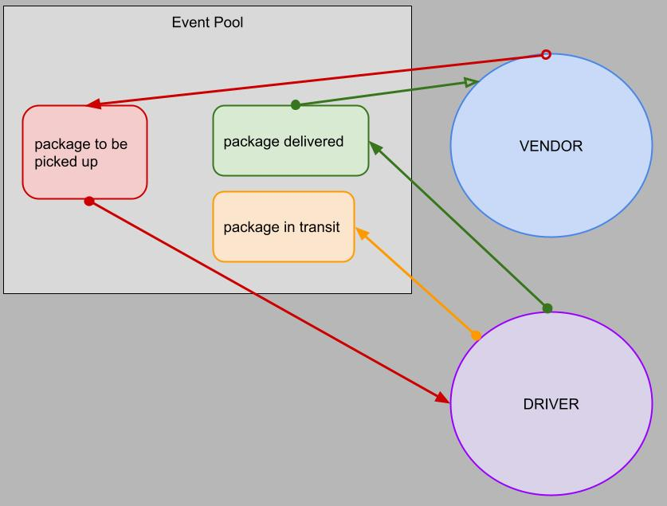

# queue (caps)

> Author: Andrew Schiller

> ## Problem Domain

Build out a system that emulates a real world supply chain. Simulate a delivery service where vendors (such as flower shops) will ship products using our delivery service and when our drivers deliver them, each vendor will be notified that their customers received what they purchased.

Specifically: implement a “queue” system so that nothing gets lost. Every event sent will be logged and held onto by the server until the intended recipient acknowledges that they received the message. At any time, a subscriber can get all of the messages they might have missed.

> ## UML

> ## Getting Started

> ### Standard dependencies

- socket.io, socket.io-client, jest

> ### Optional dependencies

- [chance](https://chancejs.com/)

> ## Links

- [GitHub pull request](https://github.com/schillerandrew/caps/pull/3)
- [GitHub actions](https://github.com/schillerandrew/caps/actions)

> ## Architecture

- **runtime:** Node
- **server:** n/a
- **database:** n/a
- **deployment:** n/a
